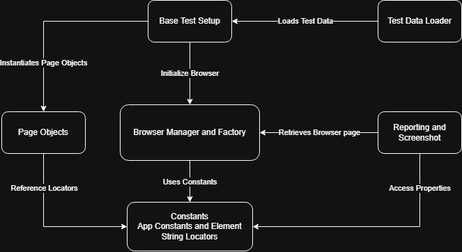
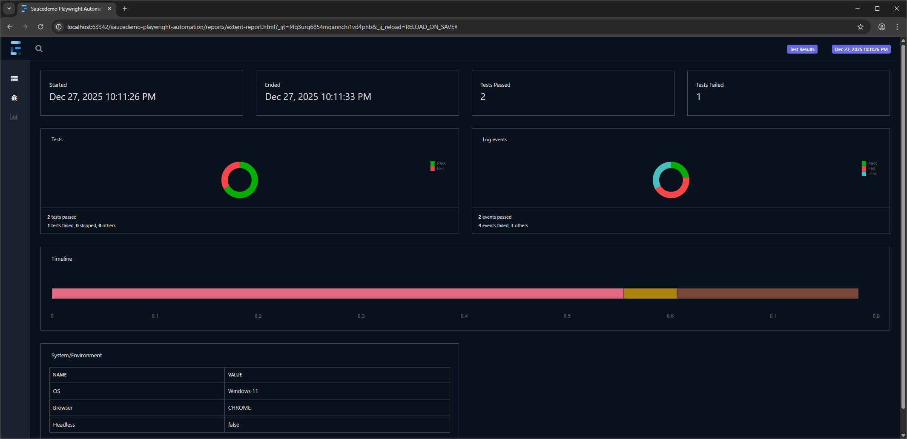
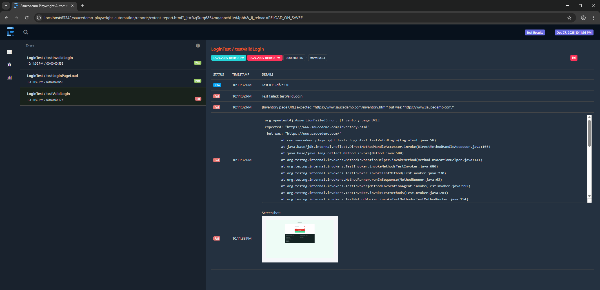

# Overview
This project implements a scalable and maintainable automated end-to-end testing framework for the
Sauce Demo e-commerce site using Playwright with Java, following the Page Object Model (POM) design pattern.
It simulates typical user journeys such as logging in, browsing products, adding items to the cart, and
completing checkout. The framework is built for maintainability and reliability, providing detailed test
reports and efficient browser management.

## Key Features
- Automated end-to-end testing of Sauce Demo e-commerce site.
- Built using **Java**, **Playwright**, **TestNG**, and **Maven**.
- Implements **Page Object Model (POM)** design pattern for maintainable and readable code.
- Supports **remote execution** via Selenium Grid and **parallel testing**.
- Integrated with **Jenkins Pipeline** for CI/CD automation.
- Generates detailed **ExtentReports** with screenshots and test IDs for failed tests.
- Comprehensive logging with **Log4j2** for debugging and tracking.

## Technologies Used
|                   |                       |
|-------------------|-----------------------|
| Language          | **Java**              |
| Build Tool        | **Maven**             |
| UI Framework      | **Playwright**        |
| Testing Framework | **TestNG**            |
| Design Pattern    | **Page Object Model** |
| Logging           | **Log4j2**            |
| Reporting         | **ExtentReports**     |
| Remote Execution  | **Selenium Grid**     |
| CI/CD             | **Jenkins**           |

## Test Architecture
A High Level Diagram of this framework is shown below.


## Folder Structure
```
saucedemo-playwright-java/
├── src/
│   ├── main/
│   │   ├── java/com/saucedemo/playwright/
│   │   │   ├── base/			# Base Page class
│   │   │   ├── browser/		# Browser Manager/Factory logic
│   │   │   ├── constants/		# App constants and string locators
│   │   │   ├── listeners/		# Report & Logging listeners
│   │   │   ├── pages/			# Page Object classes
│   │   │   └── utils/			# Config reader, Screenshot utils, etc.
│   │   └── resources/			# Global properties and Log4j2 config
│   └── test/
│       ├── java/com/saucedemo/playwright/
│       │   ├── base/			# Base Test class (Setup/Teardown)
│       │   ├── dataprovider/   # Test data providers
│       │   └── tests/			# Functional test classes
│       └── resources/			# Test runners (testng.xml) and test data
├── assets/	                    # README images
├── Jenkinsfile                 # CI/CD pipeline definition
├── docker-compose.yaml         # Selenium Grid infrastructure
└── pom.xml                     # Project dependencies and build config
```

## Getting Started
### Prerequisites
- Java Development Kit (JDK) 21 or higher
- Maven 3 or higher for build and dependency management
- Playwright installed in your project (can be done via Maven dependencies)
- Selenium Grid setup (optional, for remote execution)
- Docker (optional, for running Selenium Grid in containers)
- Jenkins (optional, for CI/CD integration)

### Installation
- Fork or download this repository
- Clone the repository and navigate to the project directory:
   ```shell
    $ https://github.com/[your_username]/saucedemo-playwright-java.git
    $ cd saucedemo-playwright-java
   ```

### Running Tests
#### Locally
- Open a terminal and navigate to the project directory and enter any of the command below:
  ```shell
    #running all tests
    mvn clean test
  
    #running specific test suite
    mvn clean test -Dtest=<test_class_name>
  
    #optional parameters: -Dbrowser=<BROWSER_NAME> -Dheadless=<true/false>
    mvn clean test -Dtest=LoginTest -Dbrowser=CHROMIUM -Dheadless=false
   ```
#### Remotely (using Selenium Grid and Docker)
- Open docker desktop:
   ```shell
   docker desktop start
   ```
- Start the containers for Selenium Grid:
   ```shell
    docker compose up -d
    ```
- To connect Playwright to Selenium Grid, set the SELENIUM_REMOTE_URL environment variable. 
This variable should be set to the address of your Selenium Grid hub (for demo, this would typically be an address like
http://localhost:4444 when running on a local machine). Note that this only works for Google Chrome and Microsoft Edge.


  - Windows (Command Prompt):
    ```shell
    set SELENIUM_REMOTE_URL=http://localhost:4444
    mvn clean test -Dtest=LoginTest -Dbrowser=CHROMIUM -Dheadless=false
  - Linux/Mac (Terminal):
    ```shell
    SELENIUM_REMOTE_URL=http://localhost:4444 mvn clean test -Dtest=LoginTest -Dbrowser=CHROMIUM -Dheadless=false
      ```
- When finished, you can stop the containers and close the Docker Desktop application:
   ```shell
   docker compose down
   ```
  ```shell
   docker desktop stop
   ```
  
#### Via Jenkins (Pipeline Job)
- Ensure your Jenkins server is installed, configured, and running.
- Create a **Pipeline job** in Jenkins and configure it to pull the project from your version control system  
  (e.g., GitHub repository URL with valid credentials or token).
- The `Jenkinsfile` located in the project root defines the CI pipeline, including:
  - Project build
  - Test execution
  - Report generation
- The pipeline includes an email notification stage, so ensure Jenkins email settings (SMTP, credentials, and recipients)  
  are properly configured.
- Save and run the Pipeline job to automatically build the project and execute the test suite, then review the  
  published reports and console output for results.

## Reporting
ExtentReports generates detailed HTML reports for test execution. The reports include:
- **Test Summary**: Overall test execution summary with pass/fail counts.
- **Test Details**: Detailed information for each test, including status, execution time, and any errors encountered.
- **Screenshots**: Screenshots of the web page when a test fails.
- **Test ID**: Unique identifier for each test run, which can be used to track specific test executions in logs.

Sample Screenshots of generated Extent Report:
- Dashboard View:
  


- Test Case View:
  

## Logging
The framework uses Log4j2 for logging important events during test execution. Logs include:
- Test execution details
- Errors and exceptions
- Test IDs for each test for easier tracking.
```text
Sample Log Entry:
2025-12-27 22:11:32.903 INFO  [2df7c370] - Test started: LoginTest/testValidLogin
2025-12-27 22:11:32.905 DEBUG [2df7c370] - Performing login sequence...
2025-12-27 22:11:32.905 INFO  [2df7c370] - Navigating to Login Page: https://www.saucedemo.com
2025-12-27 22:11:32.923 DEBUG [2df7c370] - Entering username: standard_user
2025-12-27 22:11:32.934 DEBUG [2df7c370] - Entering password.
2025-12-27 22:11:32.939 DEBUG [2df7c370] - Clicking login button.
2025-12-27 22:11:32.966 INFO  [2df7c370] - Verifying inventory page components after login.
2025-12-27 22:11:32.973 ERROR [2df7c370] - Test failed: LoginTest/testValidLogin
```
